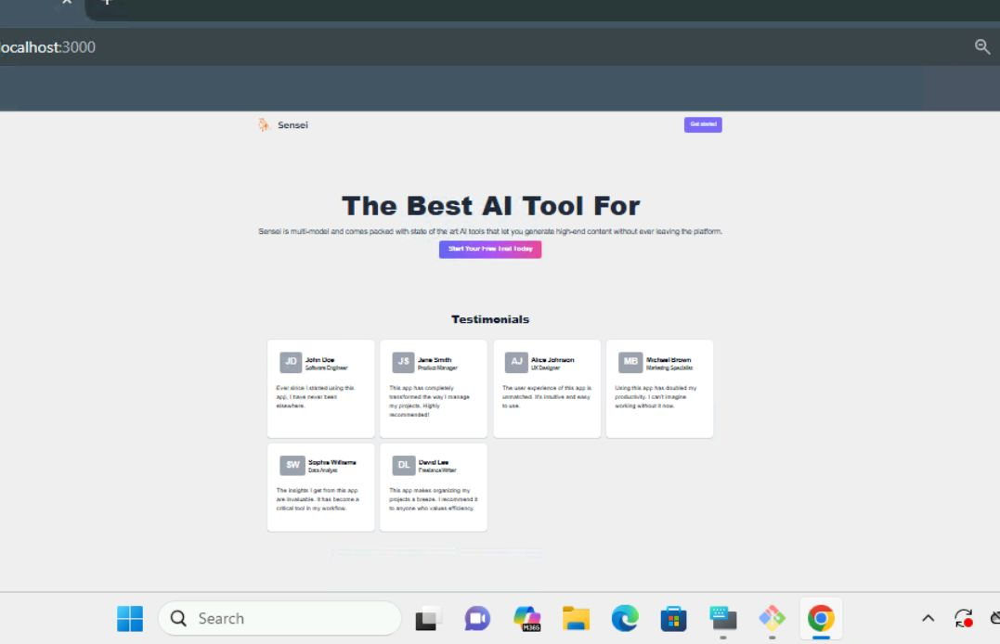
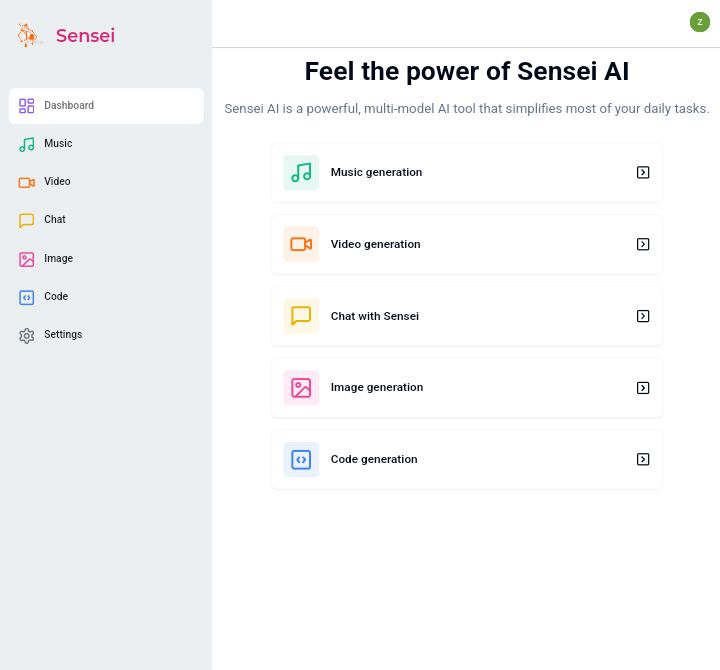

# Sensei AI | The Best AI Tool You Will Ever Need

The **Sensei AI** project is an all-in-one AI-powered software platform designed to provide multiple functionalities, including AI-based chat, code generation, image generation, video processing, music generation, and more. This project leverages modern web technologies and TypeScript to deliver a seamless and scalable experience.


## Table of Contents
- [Features](#features)
- [Tech Stack](#tech-stack)
- [Folder Structure](#folder-structure)
- [Getting Started](#getting-started)
  - [Prerequisites](#prerequisites)
  - [Installation](#installation)
- [Usage](#usage)
- [API Endpoints](#api-endpoints)
- [Contributing](#contributing)
- [License](#license)

---

## Features
- **User Authentication**: Sign-in and sign-up functionality.
- **Dashboard**: Centralized UI for managing all AI functionalities:
  - AI Chat
  - Code Generation
  - Image Generation
  - Video Processing
  - Music Generation
  - Settings and customizations
- **Landing Page**: A beautifully designed marketing page.
- **Responsive UI**: Built with reusable components and fully responsive layouts.
- **Integration with AI Models**: Seamless backend APIs for AI functionalities.
- **Payment API**: Integration with MPesa for handling subscriptions and payments.


### Screenshots




---

## Tech Stack
- **Frontend**: React (with Next.js)
- **Backend**: TypeScript, Next.js API routes
- **Database**: Prisma ORM (likely using PostgreSQL, MySQL, or another database)
- **Styling**: Tailwind CSS
- **Others**: ESLint, PostCSS, Crisp Chat integration

---

## Folder Structure
Here's a high-level overview of the folder structure:

- **`app/`**: Main application code for routes and layouts.
  - `auth/`: Handles user authentication routes (sign-in, sign-up).
  - `dashboard/`: Contains the dashboard layout and routes for features like chat, code, image, video, and music.
  - `landingpage/`: Landing page components.
  - `api/`: Backend API routes for handling AI functionalities and payments.
- **`components/`**: Reusable UI components (e.g., buttons, modals, avatars).
- **`hooks/`**: Custom React hooks for managing state and modals.
- **`lib/`**: Helper utilities, including database configuration and API limiters.
- **`prisma/`**: Database schema definition.
- **`public/`**: Static assets (e.g., images, icons).
- **`styles/`**: Global styles and configurations (via `globals.css`).
- **Root files**:
  - `next.config.ts`: Next.js configuration.
  - `tailwind.config.ts`: Tailwind CSS configuration.
  - `middleware.ts`: Middleware for request handling.

---

## Getting Started

### Prerequisites
- **Node.js**: Ensure Node.js v14 or higher is installed.
- **Package Manager**: Use `npm` or `yarn`.
- **Database**: Ensure your database (e.g., PostgreSQL) is set up and running.

### Installation
1. Clone the repository:
   ```bash
   git clone https://github.com/kc-clintone/Sensei-ai_saas.git
   cd Sensei-ai_saas
   ```

2. Install dependencies:
   ```bash
   npm install
   ```

3. Configure the environment:
   - Create a `.env` file in the root directory.
   - Add the required environment variables (e.g., database URL, API keys).

4. Set up the database:
   ```bash
   npx prisma migrate dev
   ```

5. Run the development server:
   ```bash
   npm run dev
   ```

6. Open the app in your browser:
   ```bash
   http://localhost:3000
   ```

---

## Usage
- **Landing Page**: View the app's main marketing page.
- **Authentication**: Sign in or sign up to access the dashboard.
- **Dashboard**: Interact with AI features like chat, code generation, image creation, and more.
- **Settings**: Customize your user preferences.

---

## API Endpoints
Below are some of the available API routes:

- **Chat API**: `POST /api/chat` – Send and receive AI-generated responses.
- **Code API**: `POST /api/code` – Generate code snippets based on prompts.
- **Image API**: `POST /api/image` – Create AI-generated images.
- **Music API**: `POST /api/music` – Generate AI-composed music.
- **Video API**: `POST /api/video` – Process and edit videos with AI.
- **Payment API**: `POST /api/mpesa` – Handle subscriptions and payments.

---

## Contributing
Contributions are welcome! Follow these steps to contribute:
1. Fork the repository.
2. Create a new branch:
   ```bash
   git checkout -b feature-branch
   ```
3. Commit your changes:
   ```bash
   git commit -m "Add your message here"
   ```
4. Push the branch:
   ```bash
   git push origin feature-branch
   ```
5. Submit a pull request.

---

## License
This project is licensed under the MIT License. See the `LICENSE` file for details.
